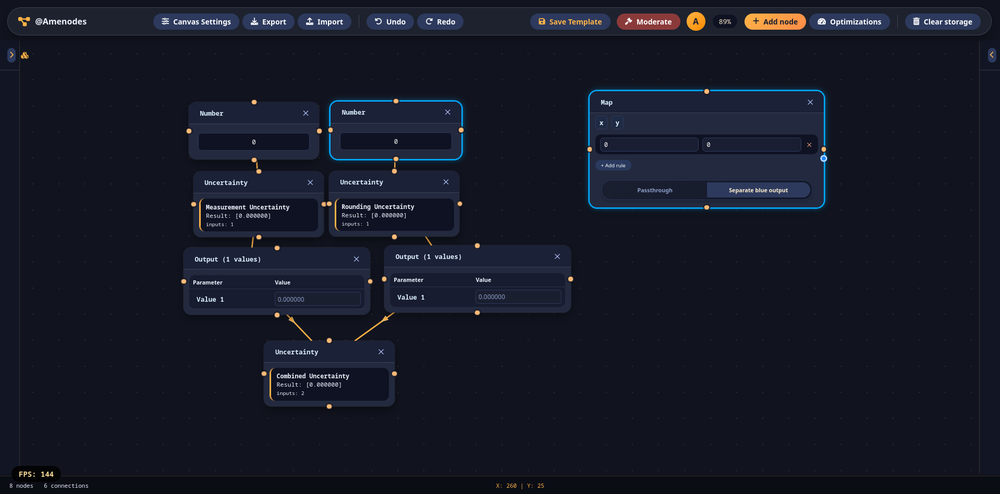
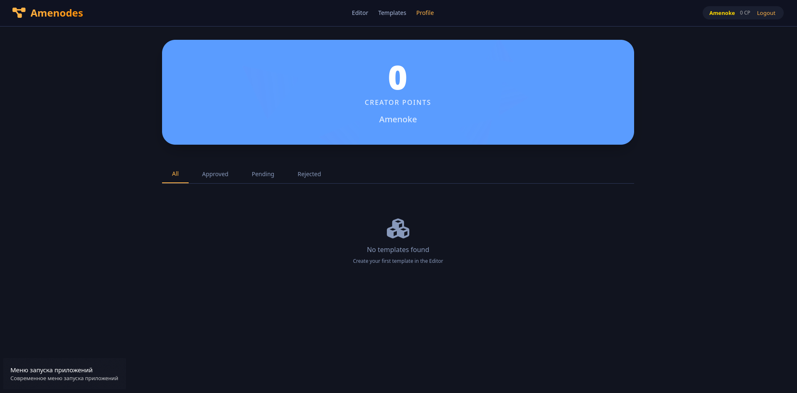

<h1 align="center">Amenodes</h1>

<p align="center">
  <strong>2.5.0</strong><br>
  <sub>Visual Programming Language for Data Analysis</sub>
</p>

<h4 align="center">
  <b><a href="https://github.com/inzexg-coder/Amenodes">GitHub Repository</a></b>
  •
  <b><a href="https://amenoke.ru/amenodes.html">Live Demo</a></b>
  •
  <b><a href="https://github.com/inzexg-coder/Amenodes/wiki">Wiki Docs</a></b>
</h4>

---

## 📖 About Amenodes

**Amenodes** is a node-based visual programming language developed in JavaScript for data analysis and calculations, replacing cumbersome Excel spreadsheets with a flexible, visual interface and a rich set of mathematical tools.

### Key Features

- **Visual Node Editor** – Drag-and-drop nodes, connect them with wires, and see results update in real-time.
- **Rich Node Library** – Number nodes, constants, groups, calculators (uncertainty propagation), mapping nodes, confidence intervals, and output displays.
- **Real-time Computation** – Automatic reevaluation when connections or values change.
- **Type System** – Smart connection validation prevents invalid links (e.g., connecting text to a number input).
- **Internationalization (i18n)** – Full support for English and Russian with an easy-to-extend translation system.
- **Performance Optimizations** – Built-in benchmarking and optimization panel with toggle switches and real-time FPS gain display.
- **Undo/Redo** – Full history with auto-save to localStorage.
- **Import/Export** – Save your graphs to `.amnk` files and load them back.
- **Pan & Zoom** – Right-click drag to pan, scroll to zoom.
- **Customizable UI** – Design quality slider to trade off visual effects for performance (up to +300% FPS).
- **Dirty State Indicator** – Visual feedback for unsaved changes: asterisk `(*)` appears next to node titles and status bar shows "Unsaved changes" when graph has pending modifications.

<div align="center">
  
</div>

### Social & Templates

- **User Accounts** – Register and login to save your schemas as templates
- **Template Library** – Publish, browse and search community-created node schemas
- **Moderation System** – Moderators approve templates and award Creator Points
- **Creator Points (CP)** – Earn points for approved templates, unlock visual upgrades
- **Dynamic Color Scale** – Profile and template cards glow based on author's CP
- **User Profiles** – Track your CP and manage your published templates

<div align="center">
  
</div>
---

## 🚀 Quick Start

### Live Demo

Try Amenodes online: **[https://amenoke.ru/amenodes.html](https://amenoke.ru/amenodes.html)**

### Template Library

Browse community templates: **[https://amenoke.ru/templates.html](https://amenoke.ru/templates.html)**

### Local Development

1. Clone the repository:
   ```bash
   git clone https://github.com/inzexg-coder/Amenodes.git
   cd Amenodes
   ```

2. Start a local server (e.g., with Python):
   ```bash
   python -m http.server 8000
   # or
   npx serve .
   ```

3. Open `http://localhost:8000/amenodes.html` in your browser.

---

## 🎮 User Guide

### Creating Nodes

Click the **+** button in the toolbar or right-click on an existing node's handle to open the node menu. Select any node type – it will appear on the canvas.

### Connecting Nodes

- Click and drag from a colored circle (handle) on the right/bottom/top/left of a node to another node's handle.
- A line with an arrow indicates the connection.
- Right-click on a connection line to delete it.

### Working with Nodes

- **Edit titles** – Click on any node title to rename it.
- **Mark as important** – Right-click on a node and select "Mark IMPORTANT node" – the node gets a blue glow.
- **Delete nodes** – Click the ✕ button in the node header.
- **Drag nodes** – Click and drag the header to move nodes around.
- 
### Saving Changes

- **Dirty indicator** – When you make any changes to the graph (add/remove nodes, create/delete connections, move nodes, edit values), an asterisk `(*)` appears next to each node title and the status bar shows "Unsaved changes".
- **Auto-save** – The graph is automatically saved to localStorage when you make changes. The dirty indicator disappears after auto-save.
- **Manual save** – Click **Export** to save your graph to a `.amnk` file. The dirty indicator clears after successful export.
- **Page title indicator** – When you have unsaved changes, the page title shows `* @Amenodes` to remind you even when the tab is not active.
- 
### User Account & Templates

1. **Register/Login** – Click the login button in the top-right corner
2. **Save Template** – After creating a schema, click "Save Template" (appears when logged in)
3. **Wait for Moderation** – Templates are reviewed by moderators
4. **Earn Creator Points** – Approved templates award CP (1 CP per template)
5. **Browse Templates** – Visit the Template Library to discover community schemas

### Template Library Features

| Feature | Description |
|---------|-------------|
| **Search** | Find templates by title, description, or author |
| **Filter** | Show all templates or only approved ones |
| **Sort** | Newest first, most CP, or most popular |
| **Visual Levels** | Templates glow with colors based on verification level |
| **One-Click Load** | Click any template to load it directly into the editor |

### Toolbar

| Button | Action |
|--------|--------|
| **Undo** | Revert the last action |
| **Redo** | Re-apply a reverted action |
| **Export** | Save your graph as a `.amnk` file |
| **Import** | Load a previously saved `.amnk` file |
| **Save Template** | Publish current schema to template library (logged in only) |
| **Clear storage** | Delete the auto-saved graph from localStorage |
| **Moderate** | Open moderation panel (moderators only) |
| **Dirty Indicator** | Shows `*` in node titles and status bar when changes are unsaved |

### Performance Panel

Click the **speedometer icon** (bottom-right) to open the optimization panel. You can:
- Enable/disable individual optimizations using **toggle switches** (apply immediately)
- Run benchmarks to measure FPS gains
- Adjust the **Design Quality** slider – displays real-time FPS gain:
  - **Extreme (≤20%)** → +300% FPS
  - **Low (21-50%)** → +150% FPS
  - **Medium (51-80%)** → +50% FPS
  - **High (81-100%)** → shows actual benchmark result

> **Note:** The panel auto-closes after applying optimizations (except Design Quality slider). All benchmark messages are fully localized (English/Russian).

---

## 🌍 Preview Environment & Deployment Servers

### Geographic Server Distribution

Amenodes uses a **two-server infrastructure** for preview deployments to ensure optimal performance and geographic distribution:

| Server | Location | Path | URL Pattern |
|--------|----------|------|-------------|
| **RU Server** | Moscow, Russia | `/ru/preview/` | `https://amenoke.ru/ru/preview/[branch]/amenodes.html` |
| **EN Server** | London, UK | `/en/preview/` | `https://amenoke.ru/en/preview/[branch]/amenodes.html` |

### How Server Selection Works

When you open a Pull Request:

1. **Smart Detection** – The system checks if your branch already has a preview on either server
2. **Existing Preview** – If found, the same server is reused (preserves your preview URL)
3. **New Preview** – If no preview exists, the server with **fewer active previews** is automatically selected
4. **Equal Load** – If both servers have the same number of previews, the RU server is chosen by default

### Preview Lifecycle

```
Branch created → Server selected → Preview deployed
       ↓
Each commit → Timer resets (preview lives 10 more minutes)
       ↓
No activity for 10 min → Preview automatically deleted
       ↓
Oldest previews removed when limit (10 per server) is reached
```

### Preview URLs

- **RU Server Preview:** `https://amenoke.ru/ru/preview/[branch-name]/amenodes.html`
- **EN Server Preview:** `https://amenoke.ru/en/preview/[branch-name]/amenodes.html`

> **Note:** Old URL pattern `https://amenoke.ru/preview/[branch]/` is automatically redirected to the new structure via symlink for backward compatibility.

### Production Deployment

Merges to `main` automatically deploy to the **root** directory:
- **Production URL:** `https://amenoke.ru/amenodes.html`
- **Template Library:** `https://amenoke.ru/templates.html`
- **User Profiles:** `https://amenoke.ru/profile.html`
- **Moderation Panel:** `https://amenoke.ru/moderate.html` (moderators only)

The following paths are **protected from deletion** during production deployment:
- `api/` – Backend API endpoints
- `ru/` – RU server previews
- `en/` – EN server previews
- `preview/` – Legacy preview redirects

### Automatic Cleanup

- Each server maintains **maximum 10 most recent previews**
- Oldest previews are automatically removed when limit exceeded
- Inactive previews (no commits for 10+ minutes) are cleaned up

---

## 📚 Developer Documentation

### Project Architecture

```
root/
├── amenodes.html                 # Main application entry point
├── templates.html                # Template library browser
├── profile.html                  # User profile page
├── moderate.html                 # Moderation panel (moderators only)
├── src/
│   ├── main.js                   # Application entry point, orchestrates all modules
│   ├── core/
│   │   ├── Graph.js              # Core graph data structure (nodes, edges, evaluation)
│   │   ├── Node.js               # Abstract base class for all node types
│   │   ├── Edge.js               # Edge/connection model
│   │   ├── History.js            # Undo/redo with localStorage autosave
│   │   └── DataType.js           # Type system for connection validation
│   ├── nodes/
│   │   ├── registry.js           # Node registration and translation loading
│   │   ├── manifest/this-manifest.js  # Node manifest
│   │   └── locales/              # Per-node translations (en/ru)
│   ├── renderer/
│   │   ├── Viewport.js           # Pan/zoom viewport controller
│   │   ├── DomRenderer.js        # DOM manipulation, edge rendering, drag handling
│   │   └── EdgeRenderer.js       # SVG edge rendering with arrows
│   ├── ui/
│   │   ├── EditableTitle.js      # Inline editable title component
│   │   ├── OptimizationPanel.js  # Performance tuning panel with toggle switches
│   │   ├── ContextMenu.js        # Right-click context menu for nodes
│   │   ├── CustomModal.js        # Custom modal dialogs (alert/confirm/prompt)
│   │   ├── LanguageSwitcher.js   # Language toggle button with dropdown menu
│   │   └── NodeMenu.js           # Node selection menu with metadata
│   ├── i18n/
│   │   ├── LanguageManager.js    # Core i18n manager with subscription system
│   │   └── locales/
│   │       ├── en.js             # Base English translations
│   │       └── ru.js             # Base Russian translations
│   ├── services/
│   │   ├── BenchmarkService.js   # Performance benchmarking with i18n
│   │   ├── PersistenceService.js # Save/load to localStorage and files
│   │   └── EventBus.js           # Event pub/sub system
│   ├── utils/
│   │   ├── SymbolMapper.js       # Greek letter and math symbol substitution
│   │   └── FPSCounter.js         # Real-time FPS measurement utility
│   └── config/
│       └── Optimizations.js      # Performance optimization definitions
├── styles/
│   └── main.css                  # All application styles
└── api/                          # Backend API endpoints (PHP)
    ├── register.php
    ├── login.php
    ├── me.php
    ├── create_template.php
    ├── moderate_template.php
    ├── search_templates.php
    ├── get_template.php
    ├── user_templates.php
    ├── delete_template.php
    └── top_users.php
```

### Backend API Endpoints

| Endpoint | Method | Description |
|----------|--------|-------------|
| `/api/register.php` | POST | User registration |
| `/api/login.php` | POST | User login (returns token) |
| `/api/me.php` | GET | Get current user info |
| `/api/create_template.php` | POST | Save a template (pending moderation) |
| `/api/moderate_template.php` | POST | Approve/reject template (moderators only) |
| `/api/search_templates.php` | GET | Search templates with filters |
| `/api/get_template.php` | GET | Get single template by ID |
| `/api/user_templates.php` | GET | Get user's templates |
| `/api/delete_template.php` | POST | Delete a template |
| `/api/top_users.php` | GET | Leaderboard by Creator Points |

### Database Schema

```sql
-- Users table
CREATE TABLE users (
    id INT UNSIGNED AUTO_INCREMENT PRIMARY KEY,
    username VARCHAR(50) NOT NULL UNIQUE,
    email VARCHAR(255) NOT NULL UNIQUE,
    password_hash VARCHAR(255) NOT NULL,
    role ENUM('user', 'moderator', 'admin') DEFAULT 'user',
    creator_points INT UNSIGNED DEFAULT 0,
    created_at TIMESTAMP DEFAULT CURRENT_TIMESTAMP
);

-- Templates table
CREATE TABLE templates (
    id INT UNSIGNED AUTO_INCREMENT PRIMARY KEY,
    user_id INT UNSIGNED NOT NULL,
    title VARCHAR(255) NOT NULL,
    description TEXT,
    graph_data JSON NOT NULL,
    status ENUM('pending', 'approved', 'rejected') DEFAULT 'pending',
    verification_level ENUM('regular', 'featured', 'epic', 'legendary', 'godlike') DEFAULT NULL,
    creator_points_awarded INT UNSIGNED DEFAULT 0,
    moderator_id INT UNSIGNED DEFAULT NULL,
    created_at TIMESTAMP DEFAULT CURRENT_TIMESTAMP,
    FOREIGN KEY (user_id) REFERENCES users(id) ON DELETE CASCADE
);

-- User tokens table (authentication)
CREATE TABLE user_tokens (
    id INT AUTO_INCREMENT PRIMARY KEY,
    user_id INT NOT NULL,
    token VARCHAR(255) NOT NULL UNIQUE,
    expires_at DATETIME NOT NULL,
    created_at TIMESTAMP DEFAULT CURRENT_TIMESTAMP,
    FOREIGN KEY (user_id) REFERENCES users(id) ON DELETE CASCADE
);
```

### Adding a New Node Type

1. Create a new node class in `src/nodes/` extending `Node` from `core/Node.js`.
2. Define `metadata` object with at least:
   ```javascript
   export const metadata = {
     type: 'myNode',           // unique identifier
     nameKey: 'nodes.myNode',  // translation key
     dataType: 'num',          // 'num', 'array', 'uncert', 'list', 'wlist', 'interval', 'auto'
     canHaveIncomingEdges: true/false,
     canHaveOutgoingEdges: true/false,
     allowedInputTypes: [...],
     allowedOutputTypes: [...],
     icon: 'fa-icon'
   };
   ```
3. Implement `createDOM(graph, renderer)` method.
4. Add translation files:
   - `src/nodes/locales/en/myNode.js` → `export default { nodes: { myNode: 'My Node' }, nodeDescriptions: {...}, dataTypes: {...} }`
   - `src/nodes/locales/ru/myNode.js` → Russian version
5. Register the node in `src/nodes/manifest/this-manifest.js`:
   ```javascript
   import { MyNode, metadata as myNodeMeta } from '../MyNode.js';
   // ... add to nodesManifest array
   ```

### Internationalization System

- **Base translations** (`src/i18n/locales/en.js`, `ru.js`) – contain UI strings (`common`, `toolbar`, `modal`, `errors`, `editor`, `templates`, `profile`, `moderate`, `optimizations`)
- **Node translations** (`src/nodes/locales/`) – contain `nodes`, `nodeDescriptions`, and node-specific UI sections
- Translations are merged via `deepMerge` – node translations override base translations
- Use `t('key')` in any component to get the current language's translation
- Language preference saved to `localStorage`
- **Benchmark messages are fully localized** (English/Russian)

### Important: Relative Imports for Preview Compatibility

All dynamic imports **MUST** use relative paths (starting with `./` or `../`) to work correctly in preview environments:

```javascript
// ✅ CORRECT - works everywhere
const module = await import(`./${nodeType}.js`);
const locale = await import(`./locales/${lang}/${name}.js`);

// ❌ WRONG - breaks in preview subfolders
const module = await import(`/src/nodes/${nodeType}.js`);
```

### Type System

The type system validates connections:
- Each node declares its `dataType`.
- Each node declares `allowedInputTypes` and `allowedOutputTypes`.
- `DataType.canConnect()` checks compatibility.

### Key Classes for Developers

| Class | Path | Purpose |
|-------|------|---------|
| `Graph` | `core/Graph.js` | Manages nodes, edges, evaluation |
| `Node` | `core/Node.js` | Abstract base class for nodes |
| `NodeFactory` | `nodes/NodeFactory.js` | Node creation with i18n |
| `DataType` | `core/DataType.js` | Connection type validation |
| `History` | `core/History.js` | Undo/redo with autosave |
| `Viewport` | `renderer/Viewport.js` | Pan/zoom control |
| `DomRenderer` | `renderer/DomRenderer.js` | DOM rendering, drag handling |
| `EdgeRenderer` | `renderer/EdgeRenderer.js` | SVG edge rendering |
| `LanguageManager` | `i18n/LanguageManager.js` | i18n with subscriptions |
| `BenchmarkService` | `services/BenchmarkService.js` | Performance benchmarking with i18n |
| `OptimizationPanel` | `ui/OptimizationPanel.js` | Optimization UI with toggle switches |

---

## 📝 Versioning

Format: `MAJOR.MINOR.PATCH[-PRERELEASE][-CODETYPE]`

| Component | Meaning |
|-----------|---------|
| **MAJOR** | Breaking changes |
| **MINOR** | New features (backward-compatible) |
| **PATCH** | Bug fixes |
| **PRERELEASE** | `-alphaN`, `-betaN`, `-rcN` |
| **CODETYPE** | `API`, `TYP`, `SEC`, `OPT`, `DEP`, `REM`, `SYN`, `I18N` |

---

### Commit Convention

| Prefix | Purpose |
|--------|---------|
| `feat:` | New feature or node type |
| `fix:` | Bug fix |
| `refactor:` | Code restructuring |
| `style:` | CSS/visual changes |
| `docs:` | Documentation updates |
| `perf:` | Performance optimization |
| `i18n:` | Translation changes |
| `chore:` | Build/config changes |

---

## 📬 Contact & Support

<a href="https://t.me/Amenoke" target="_blank">

</a>

<a href="https://github.com/inzexg-coder" target="_blank">

</a>

<a href="mailto:amenokeakira@gmail.com" target="_blank">

</a>

---

**Repository:** https://github.com/inzexg-coder/Amenodes  
**Live Demo:** https://amenoke.ru/amenodes.html  
**Template Library:** https://amenoke.ru/templates.html  
**Wiki:** https://github.com/inzexg-coder/Amenodes/wiki
